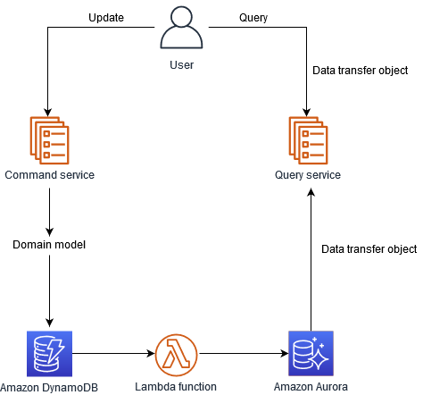

# CQRS: A Deep Dive into Command Query Responsibility Segregation

CQRS (Command Query Responsibility Segregation) just means:

👉 One part of your app is responsible for writing/updating data (Commands).
👉 Another part is responsible for reading/fetching data (Queries).

This separation can lead to improved performance, scalability, and maintainability, especially in complex systems.

Imagine you are building a pizza ordering system.

1. Command Side (Write)

When a customer places an order: Save the order into the Write Database (with all business rules like stock check, payment, etc.).

2. Query Side (Read)

When a customer wants to see their order status: Fetch from a Read Database (simpler, optimized for fast queries).

### Key Considerations for CQRS

**1. Consistency**

**Challenge**: The Command model (write side) and the Query model (read side) are often stored in different databases or structures. Keeping them in sync is crucial.

**Techniques**:

- Eventual Consistency → Updates may take a short time to reflect on the read side (common in CQRS).
- Two-Phase Commit → Ensures strong consistency but adds complexity.

**Example**: A user places an order (command DB updated). The order may appear in their “My Orders” page a second later once the query DB catches up.

**2. Complexity**

* Trade-off: CQRS adds extra moving parts: events, projectors, separate DBs, etc. 
* When Worth It: In large systems with heavy read/write load or complex queries. 
* When Not Worth It: In small CRUD apps where simple read/write directly on one DB is enough. 
* Tip: Start simple; adopt CQRS only if needed.

**3. Performance**

* Benefit: Queries can be extremely fast because the read model is tailored for UI. 
* Overhead: Extra infrastructure (events, syncing processes) adds latency and resource cost. 
* Best Practice: Benchmark both read/write latency and event lag to see if CQRS truly improves performance for your scenario.

**4. Testability**

* Goal: Each side (Command, Query, Projectors, Event handlers) should be easy to test in isolation. 
* Techniques:
  * Dependency Injection for swappable components. 
  * Mocks/Stubs for external systems (e.g., broker, read DB). 
  * Unit tests for command validation, integration tests for event flow.
* Example: You can test PlaceOrderHandler without touching the read side at all.

### When to Use CQRS

1. Complex Systems

* If your app has rich domain logic, multiple business rules, or complex workflows. 
* Example: A banking system where updating an account (debit/credit) must follow strict validation, but showing a user’s transaction history just needs fast queries.

2. High-Performance Requirements

* If you have millions of reads per second or heavy write workloads, separating models helps optimize. 
* Example: E-commerce sites like Amazon: checkout (command side) is complex, while product catalog browsing (query side) needs speed.

3. Scalability

* You can scale reads and writes independently. 
* Example: A social media app can scale queries (profile views, post feeds) separately from commands (posting, liking).

4. Security

* Separation lets you apply different security policies. 
* Example: A healthcare system where only doctors can issue updates (commands) but many roles can safely query patient history.

### When Not to Use CQRS

1. Simple CRUD Systems

* If your app is basically “forms over data” (create, update, delete, read) without heavy scale. 
* Example: An internal employee directory with <100 users doesn’t need CQRS.

2. Tightly Coupled Systems

* If reads and writes are so dependent that separating them brings no real benefit. 
* Example: A small inventory system where every update is immediately shown on screen.

3. Limited Resources

* CQRS requires extra infra: events, possibly two databases, projection handlers, etc. 
* If your team is small or project is short-lived, it may be overkill.

### CQRS vs Event Sourcing vs Read Replicas

* **CQRS**: Focuses on separating read and write responsibilities, often using different models for each.
* **Event** Sourcing: Stores a sequence of events as the primary source of truth, allowing for reconstructing the state of the system at any point in time.
* **Read Replicas**: Create copies of data for read-only access, improving performance and reducing load on the primary database.

| Aspect          | CQRS                               | Event Sourcing                              | Read Replicas                         |
| --------------- | ---------------------------------- | ------------------------------------------- | ------------------------------------- |
| **Focus**       | Separate reads vs writes           | Store all events as truth                   | Scale database reads                  |
| **Data Model**  | Different models for read/write    | Events are primary, state rebuilt from them | Same schema, just replicated copies   |
| **Consistency** | Often eventual consistency         | Replay events for consistency               | Strong (DB-managed) or near real-time |
| **Use Case**    | Complex apps with heavy read/write | Systems needing audit/history               | Scale reads without code changes      |
| **Example**     | E-commerce orders                  | Banking transactions, healthcare audit logs | Social media feed lookups             |

While CQRS and Event Sourcing can be used together, they are not mutually exclusive. Read replicas can be used in conjunction with both CQRS and Event Sourcing to further optimize read performance.

### Alternatives to CQRS

**1. Traditional CRUD**

* What it is: A single model handles Create, Read, Update, Delete operations directly against the database.
* When to Use:
  * Small applications with simple requirements. 
  * Low traffic systems where performance/scaling is not a concern.
* Example: An internal employee contact list.
* Pros: Easy to implement, minimal overhead.
* Cons: Becomes harder to maintain as complexity grows.

**2. Layered Architecture**

* What it is: Uses layers like Controller → Service → Repository → Database, each layer handling its own responsibility. 
* When to Use:
  * Applications where separation of concerns is important but CQRS is too heavy. 
  * Medium-scale apps where domain logic can stay manageable.
* Example: A typical Spring Boot app with DTOs, services, and repositories. 
* Pros: Clean structure, well-known approach. 
* Cons: Doesn’t provide the same read/write scalability that CQRS does.

**3. Microservices**

* What it is: Breaks the system into independent services, which can naturally separate read-heavy and write-heavy parts.
* When to Use:
  * Large-scale distributed systems. 
  * Teams with expertise in managing service orchestration (Kubernetes, service discovery, etc.).
* Example: A retail system where one service handles orders (writes) and another handles product catalog (reads). 
* Pros: High scalability, independent deployment. 
* Cons: Much more complex (network calls, data consistency, DevOps overhead).

### Typical Tools and Technology Stack

* Message brokers: Apache Kafka, RabbitMQ, or AWS SQS can be used to communicate between the command and query models. 
* Databases: Different databases can be used for commands and queries, such as relational databases (e.g., PostgreSQL) for commands and NoSQL databases (e.g., MongoDB) for queries. 
* Frameworks: Frameworks like Axon Framework or CQRS.NET can simplify CQRS implementation. 
* Programming languages: CQRS can be implemented in various programming languages, including Java, C#, Python, and JavaScript.

### CQRS pattern

The diagram shows the following process:

1. The business interacts with the application by sending commands through an API. Commands are actions such as creating, updating or deleting data. 
2. The application processes the incoming command on the command side. This involves validating, authorizing, and running the operation. 
3. The application persists the command’s data in the write (command) database. 
4. After the command is stored in the write database, events are triggered to update the data in the read (query) database. 
5. The read (query) database processes and persists the data. Read databases are designed to be optimized for specific query requirements. 
6. The business interacts with read APIs to send queries to the query side of the application. 
7. The application processes the incoming query on the query side and retrieves the data from the read database.

You can implement the CQRS pattern by using various combinations of databases, including:

* Using relational database management system (RDBMS) databases for both the command and the query side. Write operations go to the primary database and read operations can be routed to read replicas.
* Using an RDBMS database for the command side and a NoSQL database for the query side. 
* Using NoSQL databases for both the command and the query side. 
* Using a NoSQL database for the command side and an RDBMS database for the query side

In the following illustration, a NoSQL data store, such as DynamoDB, is used to optimize the write throughput and provide flexible query capabilities. This achieves high write scalability on workloads that have well-defined access patterns when you add data. A relational database, such as Amazon Aurora, provides complex query functionality. A DynamoDB stream sends data to a Lambda function that updates the Aurora table.

**Implementing the CQRS pattern with DynamoDB and Aurora provides these key benefits:**

* DynamoDB is a fully managed NoSQL database that can handle high-volume write operations, and Aurora offers high read scalability for complex queries on the query side.
* DynamoDB provides low-latency, high-throughput access to data, which makes it ideal for handling command and update operations, and Aurora performance can be fine-tuned and optimized for complex queries. 
* Both DynamoDB and Aurora offer serverless options, which enables your business to pay for resources based on usage only. 
* DynamoDB and Aurora are fully managed services, which reduces the operational burden of managing databases, backups and scalability.

**You should consider using the CQRS pattern if:**

* You implemented the database-per-service pattern and want to join data from multiple microservices. 
* Your read and write workloads have separate requirements for scaling, latency, and consistency. 
* Eventual consistency is acceptable for the read queries.

# How We Sync Write ➜ Read

**1. In-App Projector (what we use now)**

- How: After a write succeeds, app upserts the read model in another transaction.
- Use when: Prototyping; single service; you want immediate demo value.
- Trade-offs: Two writes in one request → add retries; not ideal if read DB is flaky.

**2. Transactional Outbox + Poller**

- How: Write data and an outbox event in the same transaction; a background job polls outbox and updates read DB.
- Use when: First production-ready step; durable; easy to reason about.
- Trade-offs: Extra table + background worker.

**3. Outbox + Message Broker (Kafka/RabbitMQ/SQS)**

- How: Same outbox, but a relay publishes to a broker; consumers project to read DB.
- Use when: Multiple services; high throughput; need fan-out.
- Trade-offs: More infra/ops; message ordering/at-least-once semantics to handle.

4. Change Data Capture (CDC) with Debezium / Kafka Connect

- How: Stream DB changes from WAL; consumers project.
- Use when: Don’t want app to emit events; near real-time.
- Trade-offs: Operate CDC stack; schema evolution discipline.

5. Postgres Logical Replication (publication/subscription)

- How: Postgres replicates tables; on the read side use triggers/materialized views to shape data.
- Use when: Pure Postgres setup; low latency; minimal app code.
- Trade-offs: Cross-DB networking/permissions; transforms live in DB.

6. DB Triggers (inside write DB)

- How: Triggers on source tables keep projection tables in sync (same DB or via FDW/dblink).
- Use when: Everything in one DB; want instant sync.
- Trade-offs: Logic hidden in DB; harder to test/version alongside app.

7. Materialized Views (refresh)

- How: Read model is a materialized view; refresh on a schedule or on demand.
- Use when: Reporting/analytics; some staleness is fine.
- Trade-offs: Consistency = refresh cadence.

8. Read Replicas (hot standby)

- How: Point reads to a replica of the write DB.
- Use when: Need read scaling, not a different shape.
- Trade-offs: Same schema; replication lag possible.

9. Batch ETL (hourly/nightly jobs)

- How: Periodic job copies/transforms data into read store.
- Use when: Back-office, dashboards, cheap/simple.
- Trade-offs: Minutes–hours of lag.

10. Event Sourcing + Projections

- How: Store domain events; build read models by replaying.
- Use when: Need full history, time travel, rebuilds.
- Trade-offs: Biggest mindset/architecture shift.

### Comparison

| Approach            | Consistency                       |  Latency | Complexity | Notes                              |
| ------------------- | --------------------------------- | -------: | ---------: | ---------------------------------- |
| In-app projector    | Eventual (very short)             |      Low |        Low | Dual write in request; add retries |
| Outbox + Poller     | Eventual (safe)                   |  Low–Med |    Low–Med | **Most common first prod step**    |
| Outbox + Broker     | Eventual (safe)                   |      Low |   Med–High | Scale, fan-out, multiple consumers |
| CDC/Debezium        | Eventual                          |      Low |       High | No app changes on write path       |
| Logical replication | Eventual                          | Very low |        Med | DB-driven, transforms in DB        |
| Read replica        | Eventual                          |      Low |        Low | Same schema only                   |
| Mat. views / Batch  | Eventual                          | Med–High |        Low | Great for analytics/reporting      |
| Event sourcing      | Eventually consistent projections |  Low–Med |       High | Full history/rebuilds              |

  
Opinion on CQRS

# Opinion & Discussion - 01

##  📌 CQRS in Context

CQRS (Command Query Responsibility Segregation) is not a silver bullet for all microservice systems.  
It’s a pattern that works well in very specific scenarios, and applying it everywhere can actually introduce unnecessary complexity.

---

## ✅ When CQRS Makes Sense

CQRS shines when:

- There are **complex transactional operations** (e.g., banking transactions, e-commerce checkout).
- These live alongside **complex reporting, analytics, or machine learning workloads**.
- Using a single database (even with read replicas) creates tension:
  - Transactional systems require **row-level updates, ACID transactions, and concurrency handling**.
  - Reporting systems thrive on **denormalized, append-only, lock-free data structures**.

👉 In these cases, CQRS provides a clean separation and allows each side to optimize for its own needs.

---

## 🟡 What CQRS Really Promotes

At its core, CQRS encourages sending **business-scope events** from the transactional side (**commands**) to the reporting side (**queries**).

- Transactional systems emit events (e.g., `OrderPlaced`, `MoneyTransferred`).
- Reporting/analysis systems consume these events to build their own **read-optimized views**.

✅ The result: decoupled systems with **eventual consistency**.

---

## 🔄 How Events Can Be Enriched

Once you have a stream of ordered business events:

- They can be **stored and replayed** to reconstruct system state.
- They can be **routed** (e.g., via Pub/Sub, Kafka) to multiple downstream consumers.
- They can feed different subsystems:
  - Analytics
  - Dashboards
  - ML models

➡️ All without burdening the transactional database.

---

## 🌐 Beyond CQRS: Gateway to Event-Driven Architectures

This makes CQRS not just a pattern but also a **gateway to event-driven architectures**.

**🏦 A Simple Analogy: Old-School Banking**

* Think of manual banking before software:
* Tellers (Command side): Handle deposits, withdrawals, and transfers — transactional operations. 
* Accountants (Query side): At the end of the day/week/month, review ledgers to calculate balances, fees, and interest — reporting operations.

The tellers don’t care about big-picture reporting; they just update accounts. The accountants don’t care about real-time transactions; they just need a consistent, eventually up-to-date view of the whole system.

